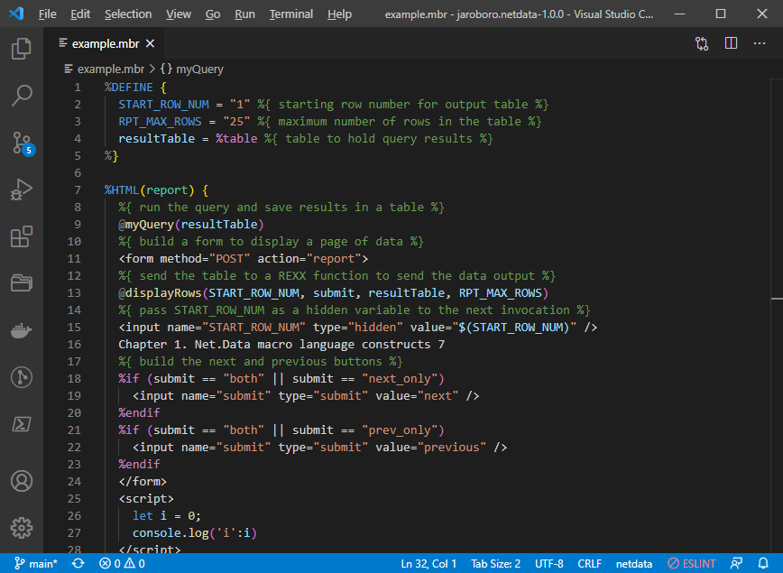
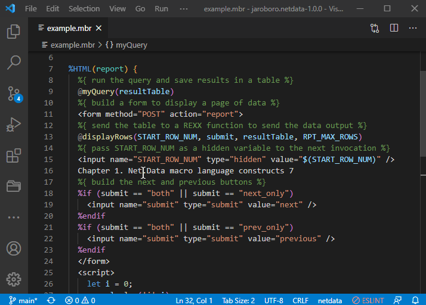
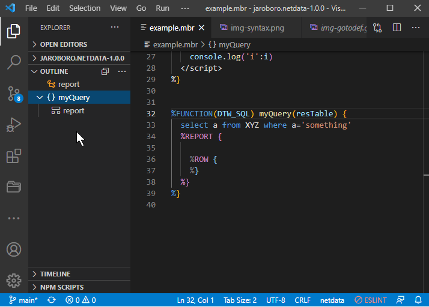

# Net.Data for Visual Studio Code

An extension for VS Code which provides support for the Net.Data language. Net.Data is a server-side scripting language that extends web servers by enabling the dynamic generation of web pages using data from a variety of data sources. The data sources can include relational and non-relational database management systems such as DB2, DRDA-enabled databases, flat-file data, and native applications written in programming languages such as RPG, Cobol, Java, C, C++, and REXX.
https://www.ibm.com/support/pages/netdata-ibm-i

## Functionality

This extension works for netdata file. It has the following language features:

- Syntax highlighting includes SQL and javascript
- Snippets for frequently used commands
- Definition of Net.Data Language
- Simple Language Client
- Go To Definition for %FUNCTION, %MACRO_FUNCTION
- Outline structure of functions, report and html block

### Syntax highlighting



### Go To Definition

You can press F12 on function call or ctrl-click.


### Outline

Easy navigation to main important block of your code.


## Structure

```
.
├── client // Language Client
│   ├── src
│       └── extension.ts // Language Client entry point
├── syntaxes
│   └── netdata.tmLanguage.json   // syntax
└── package.json          // The extension manifest.
    snippets.netdata.json // Snippets.
    language-configuration.json  // Configuration of language
```

## Issues

https://github.com/jaroborovsky/vscode-netdata/issues

## Contribution

- Download from github
- Run `npm install`
- Open VS Code on this folder.
- Press Ctrl+Shift+B to compile the client.
- Switch to the Debug viewlet.
- Select `Launch Client` from the drop down.
- Run the launch config.
- In the [Extension Development Host] instance of VSCode, open a document in 'netdata' language mode.
  - Type `html` or `funct` to see `@HTML` and `FUNCTION` snippet completion.

## Publish extension

- vsce publish
